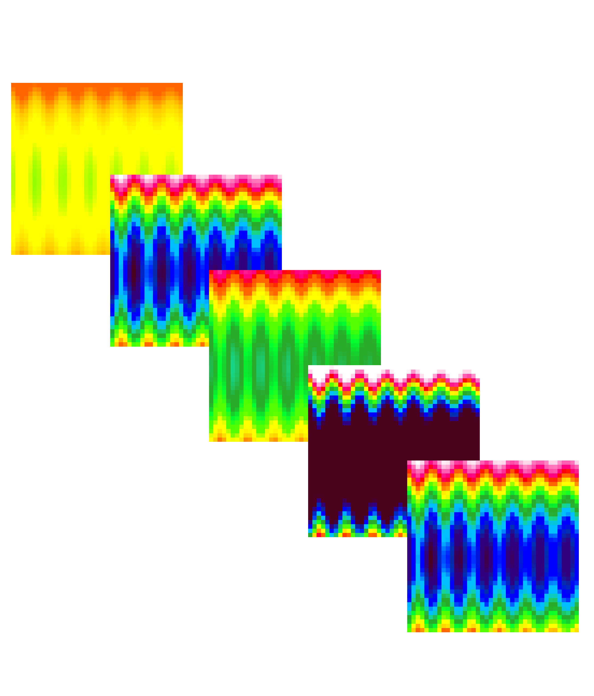

# Example 02 — Read & Inspect Metadata

Reads a 3D spectral dataset and displays all structure fields.

## Source Code

```fortran
program main
  use fpl
  implicit none

  type(nc3d_float_lld_td) :: spectral
  character(100) :: inputpath, outputpath

  inputpath  = "database/test_echam_spectral.nc"
  outputpath = "database/spectral.nc"

  spectral%varname  = "albedo_nir"
  spectral%timename = "time"
  spectral%lonname  = "lon"
  spectral%latname  = "lat"

  call readgrid(inputpath, spectral)

  write(*,*) "====== Dataset Information ======="
  write(*,'(a13,a25)')  "varname :    ", spectral%varname
  write(*,'(a13,a25)')  "timename :   ", spectral%timename
  write(*,'(a13,a25)')  "latname :    ", spectral%latname
  write(*,'(a13,a25)')  "lonname :    ", spectral%lonname
  write(*,'(a13,a25)')  "long_name :  ", spectral%long_name
  write(*,'(a13,a25)')  "varunits :   ", spectral%varunits
  write(*,'(a13,i4)')   "nlons :      ", spectral%nlons
  write(*,'(a13,i4)')   "nlats :      ", spectral%nlats
  write(*,'(a13,i4)')   "ntimes :     ", spectral%ntimes
  write(*,'(a13,f10.4)')"FillValue :  ", spectral%FillValue

  call writegrid(outputpath, spectral)
  call dealloc(spectral)
end program main
```

## Compile & Run

```bash
gfortran -o ex2.out ex2_getinfo.f90 -I/usr/lib64/gfortran/modules/ -lFPL
./ex2.out
```

## Output


