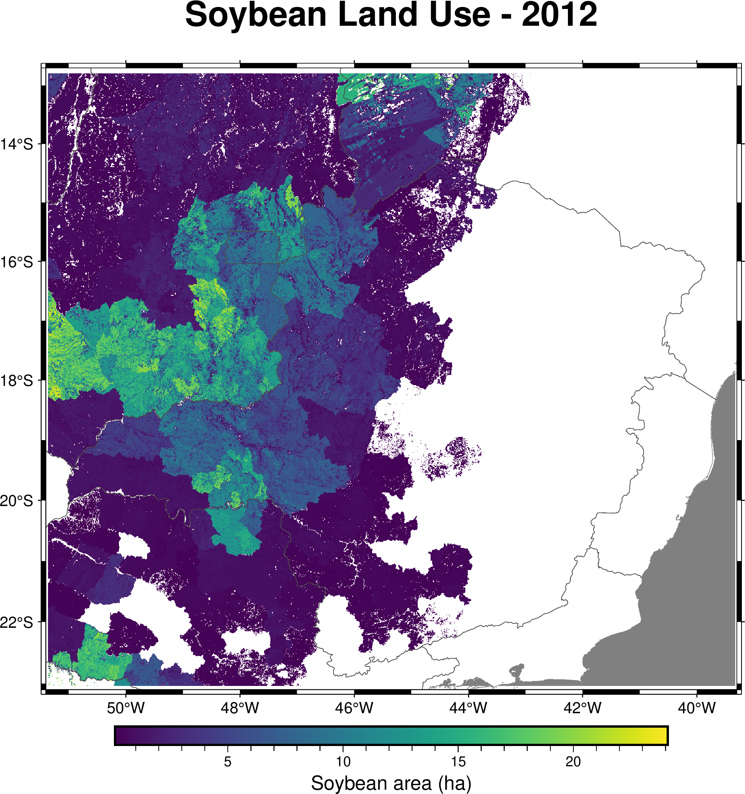

# Example 07 — Zonal Statistics (2D)

Computes soybean land use statistics grouped by Brazilian state (UF) and saves the results to CSV.

## Source Code

```fortran
program main
  use fpl
  implicit none

  type(nc2d_byte_lld)   :: zones
  type(nc2d_double_lld) :: soja

  integer(kind=intgr), parameter :: nzones = 28
  integer(kind=intgr), dimension(nzones) :: zcount
  real(kind=double), dimension(nzones) :: zmean, zmin, zmax, zsum, zvar

  character(len=20) :: uf_name(28)
  integer(kind=intgr) :: z
  character(len=100) :: ofile

  uf_name = ""
  uf_name(17) = "Tocantins"
  uf_name(18) = "Minas Gerais"
  uf_name(19) = "Goias"
  uf_name(20) = "Mato Grosso do Sul"
  uf_name(21) = "Maranhao"
  ! ... (other states)

  zones%varname = "UF"
  zones%lonname = "lon"
  zones%latname = "lat"
  zones%varunits = "class"
  call readgrid("database/brazil_UF.nc", zones)

  soja%varname = "landuse"
  soja%lonname = "lon"
  soja%latname = "lat"
  call readgrid("database/LUCULTSOJA2012.nc", soja)

  call zonalStats(zones, soja, nzones, zcount, zmean, zmin, zmax, zsum, zvar)

  ! Print and save to CSV
  ofile = "database/zonalstats_soja_2012.csv"
  open(unit=10, file=trim(ofile), status='replace', action='write')
  write(10,'(a)') "state,pixels,mean_ha,min_ha,max_ha,sum_ha,var"

  do z = 1, nzones
    if (zcount(z) > 0 .and. len_trim(uf_name(z)) > 0) then
      write(10,'(a,",",i0,",",es14.6,",",es14.6,",",es14.6,",",es14.6,",",es14.6)') &
        trim(uf_name(z)), zcount(z), zmean(z), zmin(z), zmax(z), zsum(z), zvar(z)
    end if
  end do
  close(10)

  call dealloc(zones)
  call dealloc(soja)
end program main
```

## Compile & Run

```bash
gfortran -fopenmp -o ex7.out ex7_zonalstats_2d.f90 -I/usr/lib64/gfortran/modules/ -lFPL
./ex7.out
```

## Figure



## Output

```
======================================================================
  Soybean Land Use Statistics by Brazilian State (2012)
======================================================================
               State    Pixels   Mean (ha)    Min (ha)    Max (ha)    Total (ha)
----------------------------------------------------------------------
    Distrito Federal     17168        1.10        0.00        3.61      18855.43
           Tocantins    257537        1.25        0.00       38.80     322019.68
        Minas Gerais    722848        1.42        0.00       21.60    1028328.95
            Maranhao    202259        1.84        0.00       20.95     371350.33
             Alagoas    340886        5.44        0.00       24.48    1853149.69
======================================================================
Results saved to: database/zonalstats_soja_2012.csv
```
