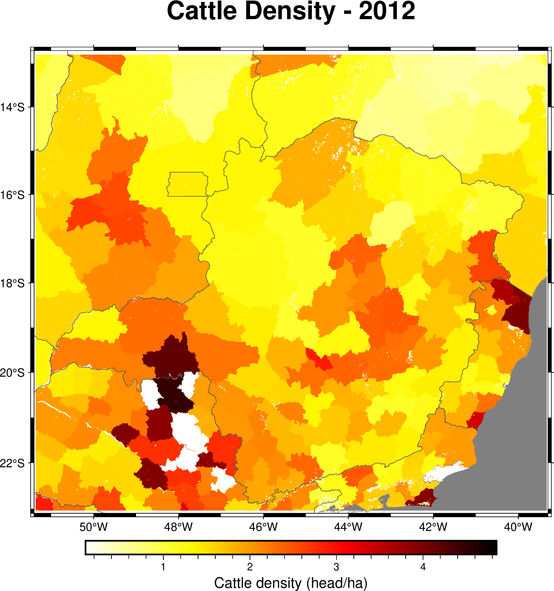

# Example 08 — Zonal Statistics (3D)

Computes cattle density statistics grouped by Brazilian state (UF) with temporal evolution from 1990 to 2012, and saves results to CSV.

## Source Code

```fortran
program main
  use fpl
  implicit none

  type(nc2d_byte_lld)      :: zones
  type(nc3d_double_lld_ti) :: cattle

  integer(kind=intgr), parameter :: nzones = 28
  integer(kind=intgr), allocatable :: zcount(:,:)
  real(kind=double), allocatable   :: zmean(:,:), zmin(:,:), zmax(:,:), zsum(:,:), zvar(:,:)

  character(len=20) :: uf_name(28)
  integer(kind=intgr) :: z, k
  character(len=100) :: ofile

  uf_name = ""
  uf_name(18) = "Minas Gerais"
  ! ... (other states)

  zones%varname = "UF"
  zones%lonname = "lon"
  zones%latname = "lat"
  zones%varunits = "class"
  call readgrid("database/brazil_UF.nc", zones)

  cattle%varname  = "Cattle"
  cattle%lonname  = "lon"
  cattle%latname  = "lat"
  cattle%timename = "time"
  call readgrid("database/CATTLE19902012.nc", cattle)

  allocate(zcount(nzones, cattle%ntimes))
  allocate(zmean(nzones, cattle%ntimes))
  allocate(zmin(nzones, cattle%ntimes))
  allocate(zmax(nzones, cattle%ntimes))
  allocate(zsum(nzones, cattle%ntimes))
  allocate(zvar(nzones, cattle%ntimes))

  call zonalStats(zones, cattle, nzones, zcount, zmean, zmin, zmax, zsum, zvar)

  ! Save to CSV
  ofile = "database/zonalstats_cattle_1990_2012.csv"
  open(unit=10, file=trim(ofile), status='replace', action='write')
  write(10,'(a)') "state,year,pixels,mean,min,max,sum,var"

  do z = 1, nzones
    if (len_trim(uf_name(z)) == 0 .or. zcount(z,1) == 0) cycle
    do k = 1, cattle%ntimes
      write(10,'(a,",",i0,",",i0,",",es14.6,",",es14.6,",",es14.6,",",es14.6,",",es14.6)') &
        trim(uf_name(z)), int(cattle%times(k)), zcount(z,k), &
        zmean(z,k), zmin(z,k), zmax(z,k), zsum(z,k), zvar(z,k)
    end do
  end do
  close(10)

  deallocate(zcount, zmean, zmin, zmax, zsum, zvar)
  call dealloc(zones)
  call dealloc(cattle)
end program main
```

## Compile & Run

```bash
gfortran -fopenmp -o ex8.out ex8_zonalstats_3d.f90 -I/usr/lib64/gfortran/modules/ -lFPL
./ex8.out
```

## Figure



## Output (excerpt — Minas Gerais)

```
  State: Minas Gerais
  Year    Pixels          Mean           Min           Max         Total
  --------------------------------------------------------------------
  1990    722848        0.7255        0.0000        1.4670     524449.24
  2000    722848        0.8844        0.0000        1.9470     639275.11
  2012    722848        1.6883        0.0000        6.5430    1220352.83
```

Results saved to: `database/zonalstats_cattle_1990_2012.csv`
