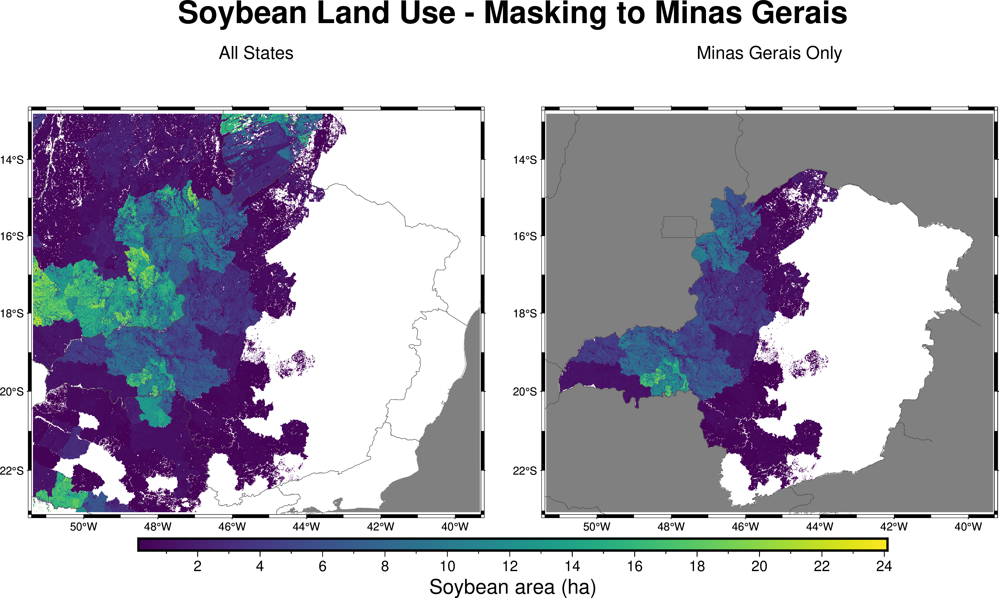

# Example 09 — Masked Zonal Statistics (2D)

Demonstrates combining `setFillValue` (masking) with `zonalStats`:

1. Computes soybean statistics for **all states** (before masking)
2. Applies a mask to keep only **Minas Gerais** (UF=18)
3. Recomputes statistics showing only the masked region

## Source Code

```fortran
program main
  use fpl
  implicit none

  type(nc2d_byte_lld)   :: mask, zones
  type(nc2d_double_lld) :: soja

  integer(kind=intgr), parameter :: nzones = 28
  integer(kind=intgr), parameter :: uf_minas_gerais = 18

  integer(kind=intgr), dimension(nzones) :: zcount
  real(kind=double), dimension(nzones) :: zmean, zmin, zmax, zsum, zvar

  ! Read mask and zone grids
  mask%varname = "UF"
  mask%lonname = "lon"
  mask%latname = "lat"
  mask%varunits = "class"
  call readgrid("database/brazil_UF.nc", mask)

  zones%varname = "UF"
  zones%lonname = "lon"
  zones%latname = "lat"
  zones%varunits = "class"
  call readgrid("database/brazil_UF.nc", zones)

  ! Read soybean data
  soja%varname = "landuse"
  soja%lonname = "lon"
  soja%latname = "lat"
  call readgrid("database/LUCULTSOJA2012.nc", soja)

  ! Step 1: Unmasked statistics
  call zonalStats(zones, soja, nzones, zcount, zmean, zmin, zmax, zsum, zvar)
  ! ... print results for all states ...

  ! Step 2: Apply mask — keep only Minas Gerais
  call setFillValue(mask, soja, uf_minas_gerais)

  ! Step 3: Masked statistics
  call zonalStats(zones, soja, nzones, zcount, zmean, zmin, zmax, zsum, zvar)
  ! ... only zone 18 (Minas Gerais) has data now ...

  call dealloc(mask)
  call dealloc(zones)
  call dealloc(soja)
end program main
```

## Compile & Run

```bash
gfortran -fopenmp -o ex9.out ex9_zonalstats_masked_2d.f90 -I/usr/lib64/gfortran/modules/ -lFPL
./ex9.out
```

## Figure



## Output

```
======================================================================
  BEFORE masking — Soybean Statistics (all states)
======================================================================
               State    Pixels   Mean (ha)    Total (ha)
----------------------------------------------------------------------
    Distrito Federal     17168        1.10      18855.43
           Tocantins    257537        1.25     322019.68
        Minas Gerais    722848        1.42    1028328.95
            Maranhao    202259        1.84     371350.33
             Alagoas    340886        5.44    1853149.69
======================================================================

 Applying mask: keeping only UF=18 (Minas Gerais)

======================================================================
  AFTER masking — Soybean Statistics (Minas Gerais only)
======================================================================
               State    Pixels   Mean (ha)    Min (ha)    Max (ha)    Total (ha)
----------------------------------------------------------------------
        Minas Gerais    722848        1.42        0.00       21.60    1028328.95
======================================================================
Results saved to: database/zonalstats_soja_2012_masked_mg.csv
```
