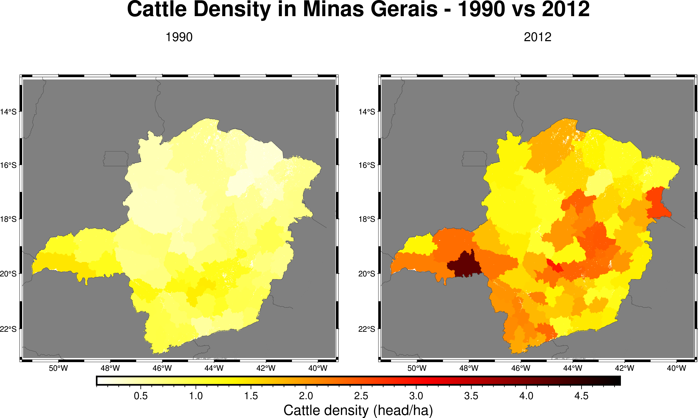

# Example 10 — Masked Zonal Statistics (3D)

Demonstrates combining `setFillValue` (masking) with `zonalStats` on 3D temporal data:

1. Computes cattle density statistics for **all states** (before masking)
2. Applies a mask to keep only **Minas Gerais** (UF=18)
3. Recomputes statistics showing temporal evolution (1990–2012) for the masked region

## Source Code

```fortran
program main
  use fpl
  implicit none

  type(nc2d_byte_lld)      :: mask, zones
  type(nc3d_double_lld_ti) :: cattle

  integer(kind=intgr), parameter :: nzones = 28
  integer(kind=intgr), parameter :: uf_minas_gerais = 18

  integer(kind=intgr), allocatable, dimension(:,:) :: zcount
  real(kind=double), allocatable, dimension(:,:) :: zmean, zmin, zmax, zsum, zvar

  character(len=20) :: uf_name(28)
  integer(kind=intgr) :: z, k
  character(len=100) :: ofile

  uf_name = ""
  uf_name(18) = "Minas Gerais"
  ! ... (other states)

  ! Read mask and zone grids
  mask%varname = "UF"
  mask%lonname = "lon"
  mask%latname = "lat"
  mask%varunits = "class"
  call readgrid("database/brazil_UF.nc", mask)

  zones%varname = "UF"
  zones%lonname = "lon"
  zones%latname = "lat"
  zones%varunits = "class"
  call readgrid("database/brazil_UF.nc", zones)

  ! Read cattle density data (1990-2012)
  cattle%varname  = "Cattle"
  cattle%lonname  = "lon"
  cattle%latname  = "lat"
  cattle%timename = "time"
  call readgrid("database/CATTLE19902012.nc", cattle)

  ! Allocate output arrays
  allocate(zcount(nzones, cattle%ntimes))
  allocate(zmean(nzones, cattle%ntimes))
  allocate(zmin(nzones, cattle%ntimes))
  allocate(zmax(nzones, cattle%ntimes))
  allocate(zsum(nzones, cattle%ntimes))
  allocate(zvar(nzones, cattle%ntimes))

  ! Step 1: Unmasked statistics
  call zonalStats(zones, cattle, nzones, zcount, zmean, zmin, zmax, zsum, zvar)
  ! ... print results for all states ...

  ! Step 2: Apply mask — keep only Minas Gerais
  call setFillValue(mask, cattle, uf_minas_gerais)

  ! Step 3: Masked statistics — temporal evolution
  call zonalStats(zones, cattle, nzones, zcount, zmean, zmin, zmax, zsum, zvar)
  ! ... only zone 18 (Minas Gerais) has data now ...

  ! Save to CSV
  ofile = "database/zonalstats_cattle_masked_mg.csv"
  open(unit=10, file=trim(ofile), status='replace', action='write')
  write(10,'(a)') "state,year,pixels,mean,min,max,sum,var"

  z = uf_minas_gerais
  do k = 1, cattle%ntimes
    write(10,'(a,",",i0,",",i0,",",es14.6,",",es14.6,",",es14.6,",",es14.6,",",es14.6)') &
      trim(uf_name(z)), int(cattle%times(k)), zcount(z,k), &
      zmean(z,k), zmin(z,k), zmax(z,k), zsum(z,k), zvar(z,k)
  end do
  close(10)

  deallocate(zcount, zmean, zmin, zmax, zsum, zvar)
  call dealloc(mask)
  call dealloc(zones)
  call dealloc(cattle)
end program main
```

## Compile & Run

```bash
gfortran -fopenmp -o ex10.out ex10_zonalstats_masked_3d.f90 -I/usr/lib64/gfortran/modules/ -lFPL
./ex10.out
```

## Figure



## Output

```
======================================================================
  BEFORE masking — Cattle Mean Density (head/ha): 1990 vs 2012
======================================================================
               State     Mean 1990     Mean 2012
----------------------------------------------------------------------
           Tocantins        0.4558        1.2741
        Minas Gerais        0.7255        1.6883
               Goias        0.8503        1.4730
  Mato Grosso do Sul        1.0375        1.7206
======================================================================

 Applying mask: keeping only UF=18 (Minas Gerais)

======================================================================
  AFTER masking — Cattle in Minas Gerais: Temporal Evolution (1990-2012)
======================================================================
  Year    Pixels          Mean           Min           Max         Total
----------------------------------------------------------------------
  1990    722848        0.7255        0.0000        1.4670     524449.24
  2000    722848        0.8844        0.0000        1.9470     639275.11
  2012    722848        1.6883        0.0000        6.5430    1220352.83
======================================================================
Results saved to: database/zonalstats_cattle_masked_mg.csv
```
